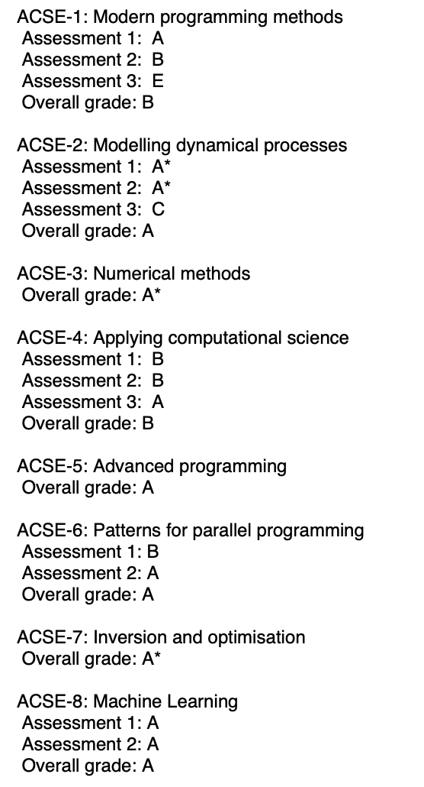

# ACSE-coursework-Jin-Yu

This repository contains all of my coursework for the the [MSc Applied Computational Science & Engineering](https://github.com/acse-2020/acse-2020.github.io), Imperial College London, year 2020-2021.
 
 

You could have an overview of what format of the coursework like, and get an idea of the workload of this course, but 
1. If you are a prospective student, do not take this as a 'cheat sheet' and expect the assessment content will be remain unchanged in the future.
2. My work could give you some inspiration, but do not take them as model answers. I got 4 **A+** (80 ~ 100), 4 **A** (70 ~ 80), 4 **B** (60 ~ 70), 1 **C** (50 ~ 60) and 1 **E** (30 ~ 40)
among these 14 courseworks, marks are below:

  

3. Hope you find this useful, and if you spot anything weird, struggle at how to execute the program or want to discuss the methodology of solutions with me,
please contact me via jin.yu20@imperial.ac.uk or yujin032@126.com.
