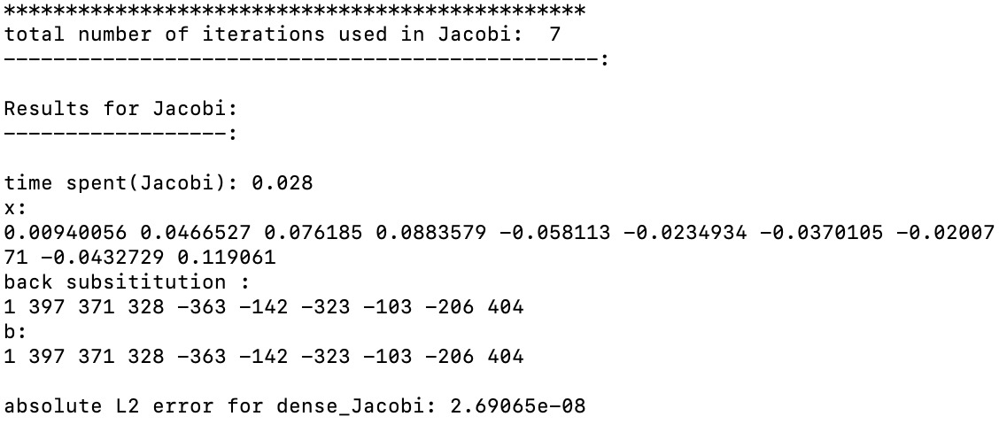
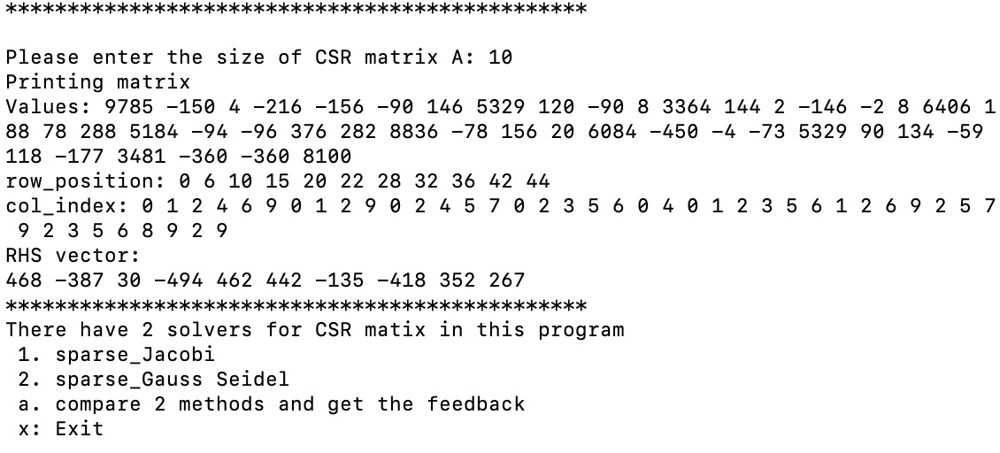
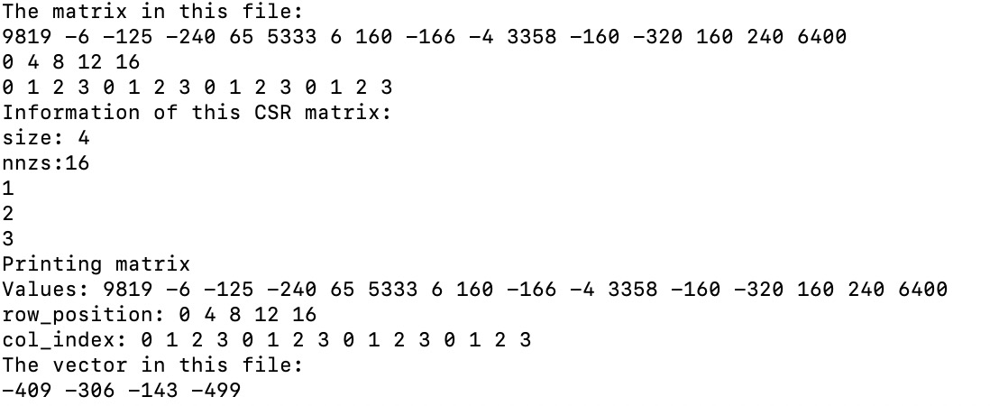
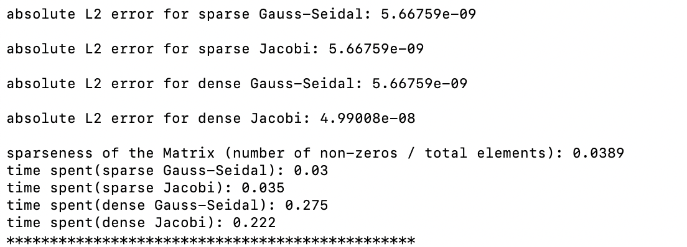
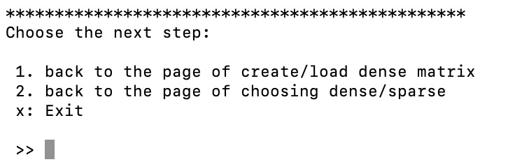
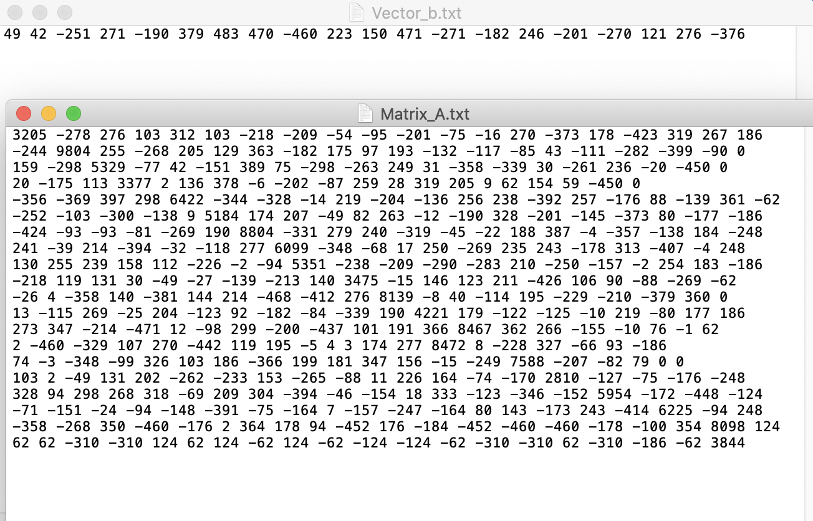
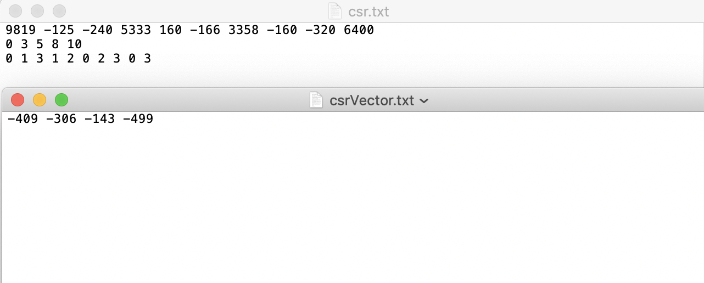

# ACSE-5 group assignment Team-inheritor

This piece of coursework was created by Jin Yu, Xuyuan Chen and Yuchen Wang.


## Compile and run the task

This task needs a link to CBLAS, you could run the shell command:

```bash
g++ main.cpp -o main -std=c++11 -L ./ -lcblas -lrefblas
 ./main
```

at the root of this repository.

## User Handbook

when you successfully execute the programme, you should see the interface as following.

<p align="center">
  
</p>

enter "y" to continue,

<p align="center">
  
</p>

the programme would then ask the type of input matrix, enter "1" it would call solvers for dense matrix, while enter "2" it would call sparse solvers.

<p align="center">
  
</p>

whether you selected dense or sparse at the last option, this window asks whether you want to input the matrix and vector yourself, or just let the system to generate a random sample itself (a positive definite dense/sparse Matrix *A* and a random vector ***b***).
<br>
<br>
<br>

[***Note***: the random generator we implemented in our programme is not completely "random", the diagonal entries are tend to have bigger absolute values than non-diagonal entries, and for better display, the entries are integers by default (but not `int` in type.)]

-------------------------------------------------------------------------------------
<p align="center">
  
</p>

If you choose the option "Randomly Create a test example", the programme will then ask you to input the size of the linear system: this is equal to the number of rows of Matrix *A*, or say, size of vector ***b***.

<p align="center">
  
</p>

We take a dense linear system of size "10" as an example, the programme would then print out a random matrix of 10 * 10, as well as a random vector of size 10 to be the RHS ***b***.

<p align="center">
  
</p>

At this window, you are free to choose the solver to solve this system, if you choose a single one, for example Jacobi, you will have the following output:

<p align="center">
  
</p>

The output shows the number of iteration it used, the spent time, and ***x*** the solution it get.

Our programme also performs a "self-error checking", we substitute the solution back, multiply with the Matrix *A*, subtracting RHS vector ***b*** and compute the L2 norm of the residual. 

<p align="center">
  
</p>


If you choose "compare 4 methods and get the feedback", you will be given the solutions for each 4 method, as well as their error and time spent saperately.

For sparse Matrix, if you chose "Randomly Create a test example", the programme will generate a positive definite sparse Matrix in CSR format:
<br>
<p align="center">
  
</p>

<br>
and print out the information for it as well as the random vector b.
<br>
<br>

If you choose to "read from the txt files", please ensure you input the CSRMatrix in the `csr.txt` with a correct format(3 rows), and the RHS vector in `csrVector.txt` (1 row). An example is already given in both `txt`s, the successfully run example likes:

<br>
<p align="center">
  
</p>

If you choose "a" to run all solvers for a sparse linear system, both sparse solvers will be called and also, our programme will transfer the CSR format input to a dense one, and also solve them with the dense solvers, as follows:
<br>
<p align="center">
  
</p>
<br>
We use the parameter (number of non-zeros / matrix elements) to define the sparseness of a Matrix, try to play with the random CSR linear system generator with a larger size, say 1000, you will find the sparse solvers obviously save time then dense solvers as the Matrix is sparser.

<p align="center">
  
</p>

After one run, this window enables you to make a second run with a Matrix of different type or alter the way of inputting data.


### Some points to note when self-implementing the Matrix data and the RHS vector

For dense systems, please input the Matrix *A* row by row into `Matrix_A.txt`. (e.g for a 10 * 10 Matrix, you should put 10 elements each row) the delimiter should be a single space `" "` between each two elements. Note there is no space at the end of each line!

<br>

Please input the entries of the RHS vector ***b*** into `Vector_b.txt`, also gapped by single spaces.

<p align="center">
  
</p>

For sparse systems, please input the CSRMatrix *A* into `csr.txt`. You should input the information with the standard CSR format: 
<p align="center">
  
</p>

<br>
The first row is the values, the second is the row_position, and the third is column_index.

<br>

And the corresponding RHS vector ***b*** for the sparse system should be input in the `csrVector.txt`, not the the same file for ***b*** as above!

<br>

With a correct input, you should see something like follows:
<p align="center">
  
</p>

<br>

And now you're ready to go to solve to linear system!