# ACSE-6 group assignment - Game of Life with OpenMP 

## Team-inheritorplus

This piece of coursework was created by Jin Yu (acse-jy220), Xuyuan Chen (acse-xc520) and Yuchen Wang (acse-sw3620).

## Compile and run the task
As this task was built on MacOS, we used the `libomp` provided by [homebrew](https://brew.sh/blog/) and use `g++-10` to compile the task, you could use any compiler on your system which supports openmp to run this task.

```bash
$ g++-10 -fopenmp main.cpp -o main -std=c++11
$ ./main
```

## User Handbook

With a successful execution, you would see this guide window,

<p align="center">
  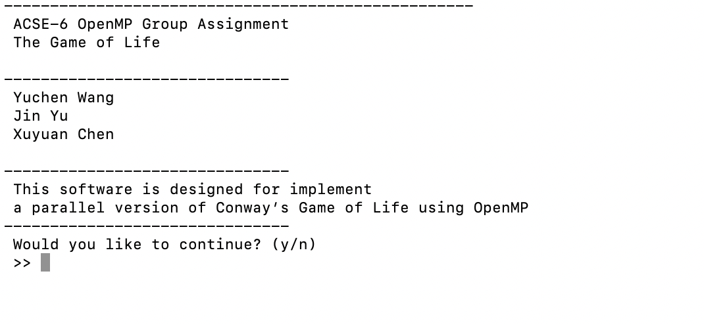
</p>

<br>

press 'yes' to continue, 

<p align="center">
  
</p>

you can see there is an option for you to choose to [generate a random grid](#1), or to [input it using a .txt file](#2) by your own.

### <span id="1">generate random grid</span>

if you choose '1', you will need to follow the steps
<p align="center">
  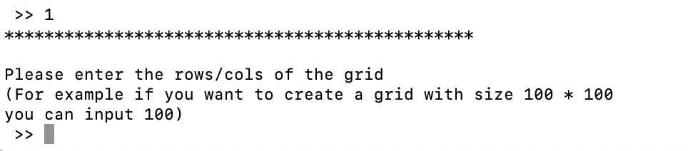
</p>

<p align="center">
  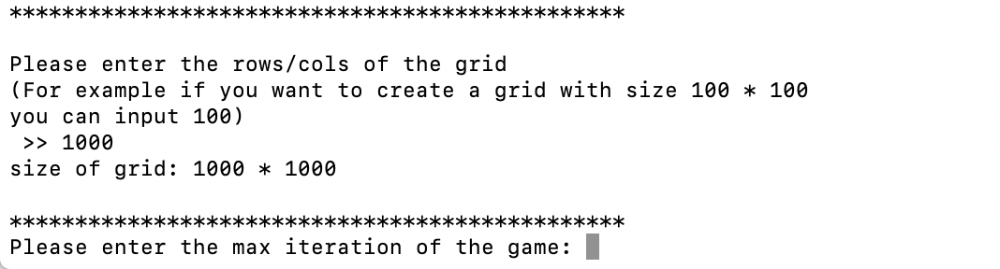
</p>

to set the size of the grid and iteration times of the game.

After that, this window would come up, 

<p align="center">
  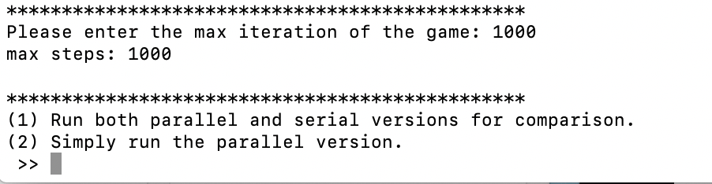
</p>

to ask you whether you want to just run the parallel version, or run the serial version as well to compare their performance.

<p align="center">
  
</p>

if you choose '1', the program would ask you to input the thread number for the parallel algorithm to use, as an example, we use the default thread_num **12**.

<p align="center">
  
</p>
<br>

Then there will be a series of outputs, the first four lines compare the serial and parallel algorithms' performance on small tasks, like index setting and initial value assignment. The 'Error' printed is just to check whether the serial version and parallel version have the same grid before and after iteration (see its definition in `Parallel.cpp`). The most important result is at the bottom, shows how much time used by serial and parallel versions respectively. As we can observe from this single trial, the parallel one we implemented do **100** times better over performance than the original serial algorithm in `ConwaysGame_Serial.cpp`!


<p align="center">
  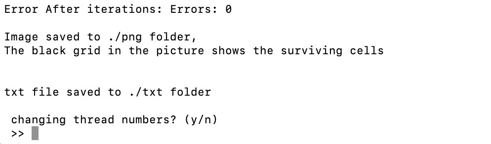
</p>
<br>

After one trial, you could change thread numbers and do it again.

<br>
If you choose to just run the parallel version, you can choose to run with a certain thread number, or run serveral trials with different thread numbers, ranging from 1 to 2 * omp_get_max_threads(), to see how performance veries using different thread nums.

<p align="center">
  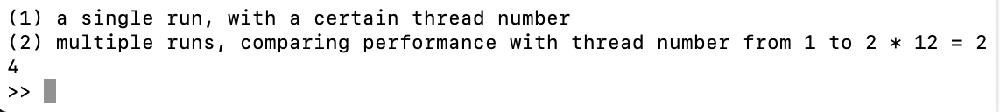
</p>
<br>

The output of running a single one is similar as above, if you choose '2', you would get a list of outputs of time consumed with different thread_num s over a same game.

<p align="center">
  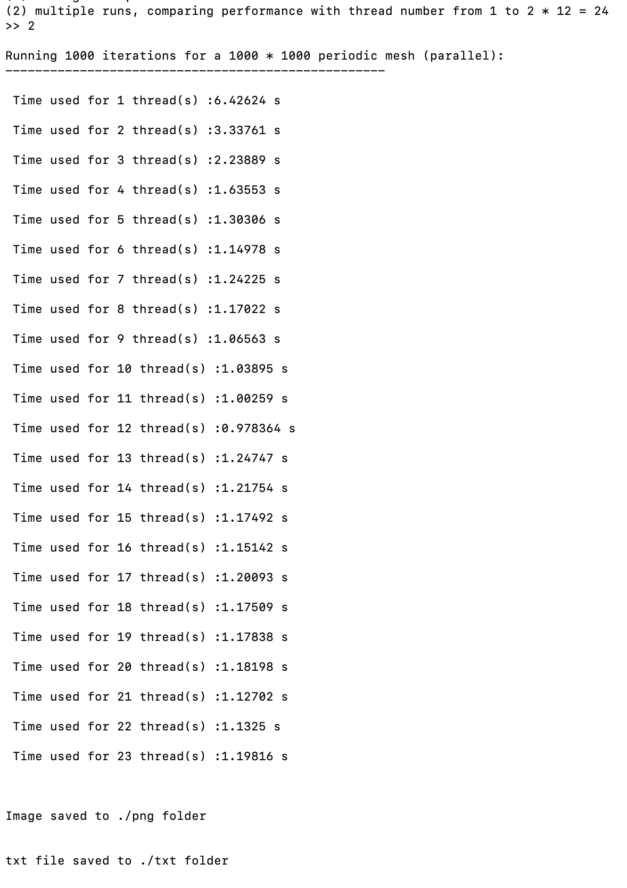
</p>
<br>

### <span id="2">input grid by txt</span>

To start with a grid you have on your hand, back to the beginning, 

<p align="center">
  
</p>
<br>

choose '2' at this window, you would find a guide window to show you the corret format to input in the **.txt** file be readable.

<p align="center">
  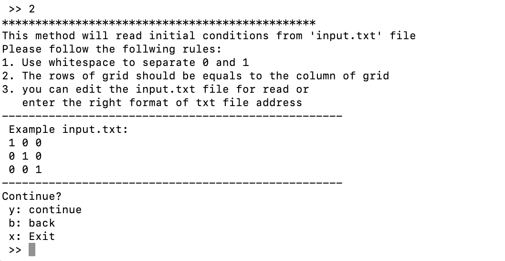
</p>
<br>

enter 'y' to continue, 

<p align="center">
  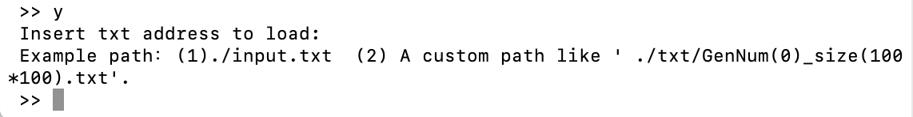
</p>
<br>

this window is to provide an extra option to read a **.txt** file from a custom path, even something at the output directory \txt. If you choose '1' it would read the grid stored in `input.txt` by default, a 100 * 100 example is given.

<p align="center">
  
</p>
<br>

<p align="center">
  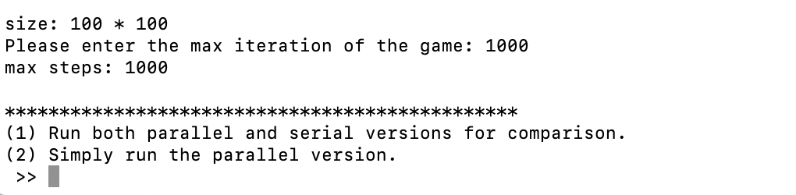
</p>
<br>

enter the iteration times, and you would continue the same processes as for a random smaple.

<p align="center">
  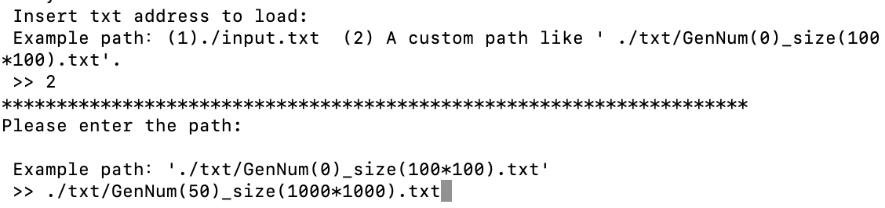
</p>
<br>

If you choose to read **.txt** from a custom path, please be sure you have entered the right relative path, otherwise the program would fail.

<p align="center">
  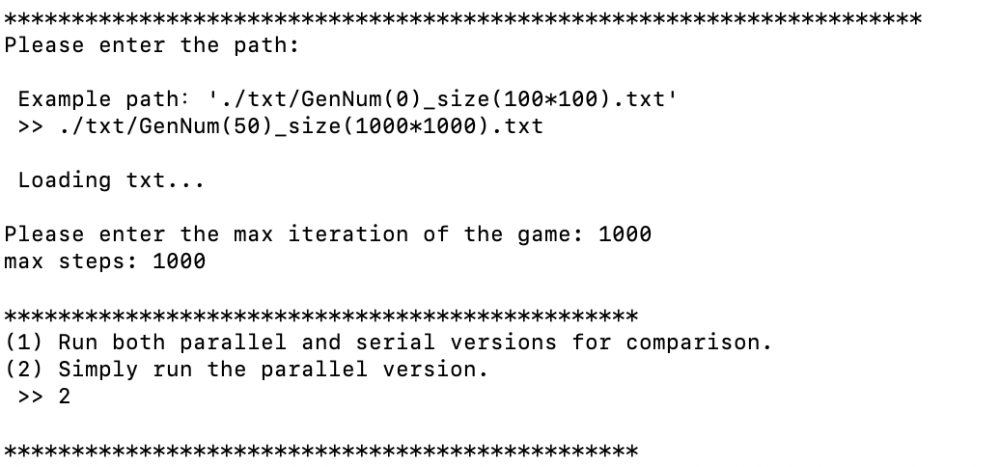
</p>
<br>

enter the iteration times and you would follow the same processes as for a random smaple.

## outputs

At each run, whether you run a comparing option, or run single parallel, or comparing between thread numbers, our programme would output the **.txt** and **.png** files for the grid at its initial stage, half stage (2 / Max_Iter_Steps) and final stage (Max_Iter_Steps), that is, a single execution would generate 6 files under 2 folders, the **.txt** files are under `/txt`, while the ouput **.png** files are under `/png`.

<br>
However, to note that our programme will not automatically clear the outputs in those two folders, and it may get very mass in the output folders if you execute the task serveral times without clearing the former results!!! So my suggestion here is if you want to verify the results for a certain grid, it's strongly recommanded that you empty the `/txt` and `/png` folder.


