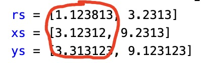
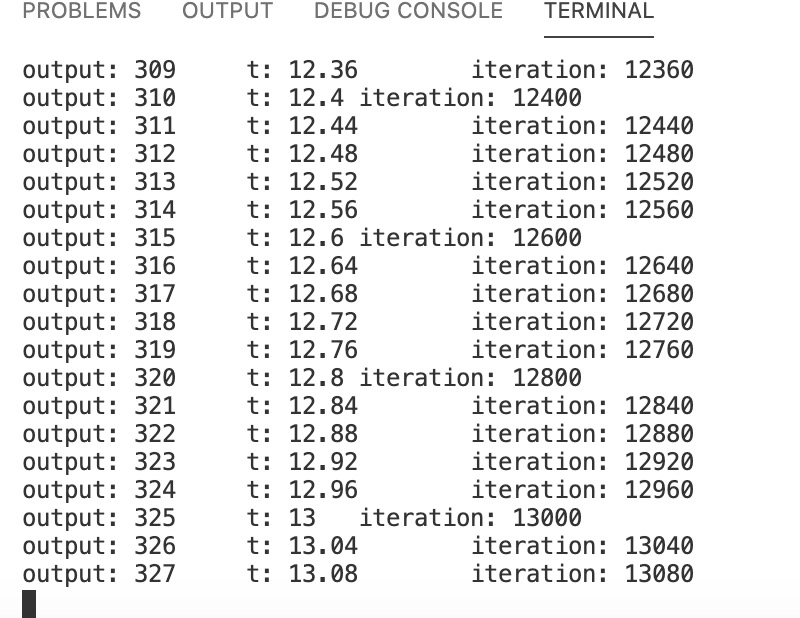
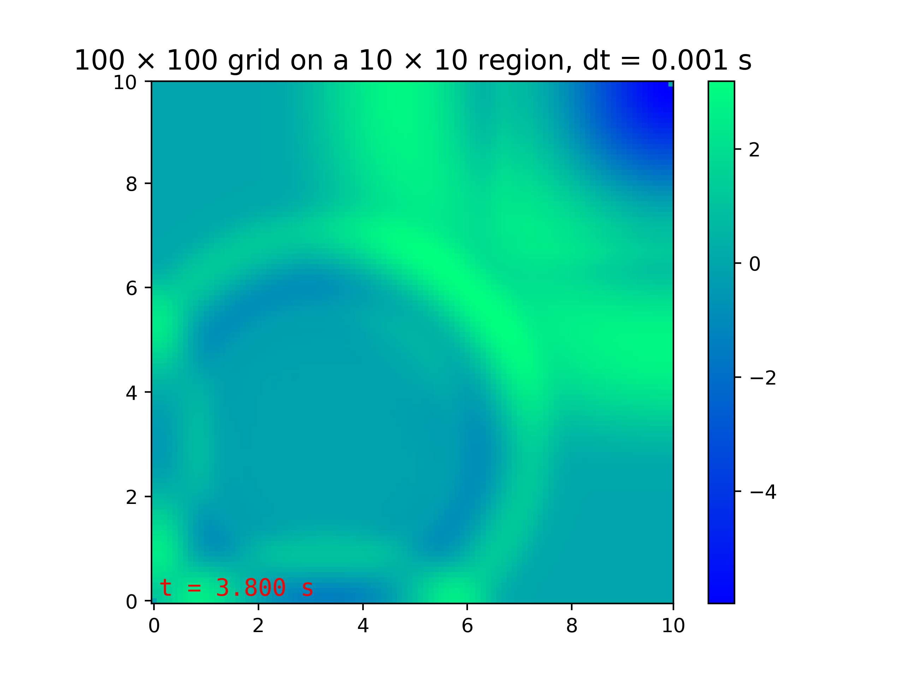

# ACSE-6  MPI Programming Assignment – Solving the Wave Equation

This piece of coursework was created by Jin Yu (acse-jy220), github handle: https://github.com/acse-jy220

## Compile and run the task
You will need a compiler which supports MPI on your system to compile and run this task.

```bash
$ mpic++ main.cpp -o main -std=c++11
$ mpiexec -n (number of nodes) ./main
```

## User Handbook
<br>

### About parameter settings 
The initial settings for the problem is located at `parameters.ini`(do not change its name! ), it offers a number of changable parameters:<br>
------------------------------Physical parameters-----------------------------------<br>
`length`: the range of the x-coordinate of the region <br>
`width`: the range of the y-coordinate of the region <br>
`imax`: number of grids in the x-coordinate <br>
`jmax`: number of grids in the y-coordinate <br>
`c`: the speed of the wave <br>
`dt`: the numerical time step we use in the forward updating scheme. <br>
---------------------------------Initial condition parameters--------------------------------<br>
for the Initial condition setting, we just use sinusoidal disturbances over a period, <br> 
where u_0 = 5.0*(cos(distance / radius * pi) + 1.0) for some disturbance. <br>
`rs`: array of radius for the disturbances<br>
`xs`: array of the x-coordinate of centers for the disturbances<br>
`ys`: array of the y-coordinate of centers for the disturbances<br>
<p align="center">
  
</p>

Note as show in the picture, a column of `rs`, `xs` and `ys` represents the radius, x-coordinate and y-coordinate for **one** specific disturbance, <br>
if you input multiple disturbances, please make sure they are on the correct indexes. <br>
----------------------------------Output parameters--------------------------------<br>
`output`: if turned on, binary files will be created in the `./ouput` folder, if not, just purely run the simulation without any outputs.
`t_out` : the output time steps, or say, output images every 't_out' seconds.<br>
`t_end` : the end time of the simulation. (of course the start time is 0)<br>
----------------------------------Boundary types-------------------------------<br>
`boundary_type`: There are three boundary types for choose, they are 'periodic', 'Neumann' and 'Dirichlet'.<br>
**periodic boundary**: eable wave to passing through boundaries <br>
 (i.e the left nerighbour of a grid on the left physical boundary is the grid on the right physical boundary) <br>
**Neumann boundary**: the divergence of 'u' is zero at the boundary, on square grid it is equal to etting the value on the boundary equal to the neighbouring point.<br>
**Dirichlet boundary**: 'u' fixed with a value of zero on boundaries<br>
----------------------------------------Display options---------------------------<br>
`display_option`: if turned on, you will see the output information throughout the simulation, like the picture given followed:<br>

<p align="center">
  
</p>

if you truned it off, a `std::out` sentence only indicates the running time of the code will be given.<br>

### Postprocessing outputs

After you run a successful simulation, the output files would be saved at the `./output` folder in a binary format. (check they are there! )<br>
You could then use python scripts to generate plots and animations from those binary files.<br>
----------------------------------Generate a single shot for a specific time point in the simulation--------------------------------<br>
If you are interested at the image of a single output file and want to view it, just type
```bash
$ python3 pic.py (number of the output)
```

It would give you a picture shot of the output state you are interested in, like following:

<p align="center">
  
</p>

If you want to save this figure, add "-save" flag at the end of the command, like:
```bash
$ python3 pic.py (number of the output) -save
```

The picture would be save at the `./pic` folder.

--------------------Generate an animation for the simulation-------------------<br>
If you want to view an animation for the simulation, just type
```bash
$ python3 animation.py
```

You can also enter any integer after a '-s' flag, indicating a speedup ratio, such as
```bash
$ python3 animation.py -s 8
```
To make the animation play 8 times faster.

Note that if you do not add the '-s' flag, the speed will just set default as 1.

If you want to save the animation, just add '-save' flag at the end, like 
```bash
$ python3 animation.py -save
```

The animation will be save at `./anime` folder, with name like "anime [length] * [width] grid (Mesh size: [imax] * [jmax]) dt = xxx, boundary_type = xxx.mp4".

I have attached the videos for three_example runs in the `./anime` folder, with intial condition being two splashs of radius 1.12381 and 3.2313, locating at (3.12312, 3.31312) and (9.2313, 9.12312) respectively.

### Something important to note

Before you run another simulation, if you are not changing 'mesh size' or 'end_time', then it would be possibly be safe to rerun directly,
but it's safer to clear the outputs of the last run before running a new simulation. 
Here I provide a script to clear the outputs, just use
```bash
bash ./clear_output.sh
```

to clear the outputs and then change the parameters in `parameters.ini` and run a new simulation.

<br>
<br>
Many thanks for using this piece of software!!!!
